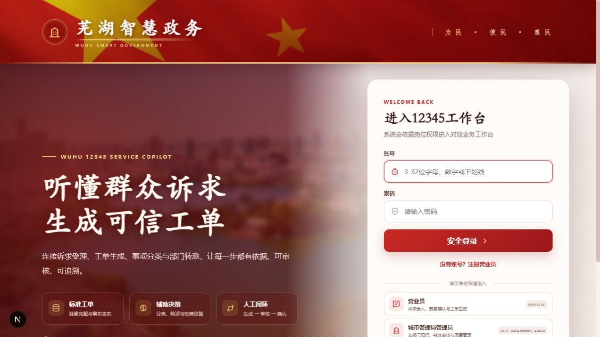
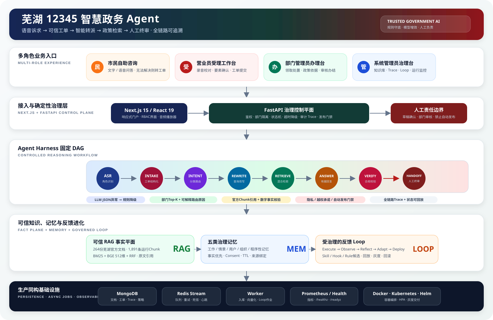

# 芜湖政务 Agent · 12345热线工单智能生成与转派辅助系统

面向芜湖市12345热线受理、审核与转派人员的政务智能体比赛项目，实现 **诉求受理 → 要素提取 → 标准工单 → 事项分类 → 部门转派 → 回复辅助 → 人工确认** 的完整闭环。

项目现按一条端到端责任链统一维护：文本/录音输入、敏感信息脱敏、诉求要素提取、缺失信息追问、标准工单生成、事项分类、部门 Top-K、政策混合检索、回复草稿和人工审核。各阶段通过统一 `StandardWorkOrder` 契约衔接，不再按人员拆分功能归属。

工单生成支持 **大模型主链路、规则降级**：经人工校对的诉求先脱敏，再交给大模型输出结构化工单和逐字段原文证据；证据不足、格式异常、服务超时或未配置密钥时自动使用规则基线，并在审核界面明确标注。出于政务数据保护考虑，外部模型调用默认关闭；确认模型服务的数据合规要求后，配置 `DEEPSEEK_API_KEY` 并显式设置 `INTAKE_LLM_ENABLED=true`。原始录音与未经整理的原始转写不会发送给模型。两种结果都必须人工确认。

> 比赛参考 HTML 与官方示例音频/Excel 仅保留在本地，默认不进入公开 Git 历史。项目数据使用必须遵守比赛授权和个人信息保护要求。

> 当前架构、比赛契约和路线图分别见 [`docs/architecture.md`](docs/architecture.md)、[`docs/competition/intake-contract.md`](docs/competition/intake-contract.md) 和 [`docs/competition/roadmap.md`](docs/competition/roadmap.md)。`design_files/` 仅保存历史设计输入，不作为当前产品说明。

> 复赛交付材料已整理在 `docs/competition/`：比赛方案、要求映射、5 分钟演示脚本、答辩问答、
> 提交清单和 [`12345智慧助手-复赛答辩.pptx`](docs/competition/12345智慧助手-复赛答辩.pptx)。

> 录音质量增强已增加离线人工标注工作台及 CER、角色序列、DER、语义字段 F1 评测，使用方法见
> [`audio-annotation-guide.md`](docs/competition/audio-annotation-guide.md)。

> 面向营业员、部门管理员、系统管理员、标注人员和运维人员的操作步骤见
> [`docs/user-manual.md`](docs/user-manual.md)。

> Windows 工作人员可直接双击根目录 [`启动芜湖政务助手.cmd`](启动芜湖政务助手.cmd) 启动系统；关闭其
> 图形窗口会同步停止本次启动的前端和后端服务。

## 项目界面



前端面向市民、营业员、部门管理员和系统管理员提供不同入口；登录后分别进入自助咨询、诉求受理、
部门办理或系统治理工作台。

## 系统架构



架构以 FastAPI 作为唯一治理控制平面，通过固定 Agent DAG 连接本地语音识别、标准工单、部门路由、
可信 RAG、合规校验与人工终审；MongoDB、Redis Stream、独立 Worker 和可观测性组件提供生产同构支撑。

| 服务 | 目录 | 职责 |
|---|---|---|
| 前端 | `web/` | React + Next.js 聊天界面 |
| 后端 | `backend/` | FastAPI：文档解析/切片/向量化、BM25+向量混合检索、MongoDB/Redis 存储、对外 REST API |
| Agent 执行引擎 | `services/pi-agent/` | 统一执行 Intent/Rewrite/Answer/Verify/Reflect 的模型推理、Agent loop 和受控工具调用 |

> Python 是唯一控制平面：负责固定 DAG、鉴权、事实、记忆、部门隔离、动态策略、灰度和回滚。
> pi 是统一的概率性 Agent 执行引擎：负责 Agent loop、模型调用和受控 tool calling。pi 不直接决定数据权限或策略发布。

## 目录结构

```
wuhu-12345-agent/
├── README.md                 # 本文件
├── docker-compose.yml        # 全栈编排（MongoDB/Redis/backend/worker/pi-agent/web）
├── .env.example              # 环境变量样例
├── Makefile
├── docs/                     # 架构 / API / 部署 / Loop 文档
├── docs/change-audit.md      # 代码修改与说明文档覆盖审计
├── backend/                  # Python 后端（见 backend/README.md）
├── services/pi-agent/        # pi 智能体服务（见 services/pi-agent/README.md）
├── web/                      # Next.js 前端（见 web/README.md）
├── deploy/                   # K8s / Helm 部署（见 deploy/README.md）
├── design_files/             # 设计输入
└── wuhu_knowledge_base/      # 芜湖官方政务文档与来源清单
```

## 🚀 安装 Docker Desktop 后怎么跑（推荐）

> 前提：已安装 [Docker Desktop](https://www.docker.com/products/docker-desktop/) 并启动（Docker 图标变为 running）。

```bash
# 1. 进入项目目录
cd program

# 2. 复制环境变量，设置数据库口令、内部令牌及首次管理员
cp .env.example .env

# 3. 一键构建并启动全栈（首次会下载镜像，较慢）
docker compose up --build -d

# 仅在已获数据外发授权且配置好模型密钥时，额外启动 pi Runtime
docker compose --profile pi up --build -d

# 4. 查看各服务状态与日志
docker compose ps
docker compose logs -f
```

启动完成后：

| 服务 | 地址 |
|---|---|
| 前端聊天界面 | http://localhost:8080 |
| 后端 API / OpenAPI 文档 | http://localhost:8000/docs |
| pi 智能体服务（显式启用时） | http://localhost:8100/health |
| MongoDB | `localhost:27017`（账号密码见 `.env`） |

### 首次建立芜湖政务知识库

```bash
# 种子数据（12 类部门/12345 术语/默认规则）
docker compose exec backend python -m scripts.seed_data

# 导入已质检的芜湖官方语料，首次建库跳过逐文档 LLM 分析
docker compose exec backend python -m scripts.ingest_department_files \
  --base /app/wuhu_knowledge_base --skip-conflicts --skip-metadata-llm
```

`seed_data` 与后端启动过程会幂等初始化“工单要素完整性核验”“政策依据与回复生成”“紧急事项风险提示”三个比赛基线 Skill。

管理端“进化 Loop”采用异步作业跟踪：触发后页面自动轮询 `queued → running → completed`，展示 Observe / Reflect / Adapt / Deploy 阶段、反馈信号、根因、候选、发布结果和策略资产前后变化。

### 模型连通性自检（doctor）

```bash
# 验证 DeepSeek 与本地中文 Embedding 能否使用
docker compose exec backend python -m scripts.doctor

# 验证 pi 框架 + DeepSeek 是否正常
# 注意：doctor 依赖 devDependencies（tsx），容器镜像内不可用，只能在本地运行：
cd services/pi-agent && npm install && npm run doctor
```

停止与清理：

```bash
docker compose down           # 停止
docker compose down -v        # 停止并清除数据卷
```

## 本地开发（非 Docker）

需 Python 3.9+（推荐 3.11）、Node.js ≥ 22.19。

```bash
# 1) 后端
cd backend
python3 -m venv .venv && source .venv/bin/activate
pip install -r requirements.txt
export STORAGE_MODE=memory   # 无 MongoDB/Redis 时用内存模式
uvicorn app.main:app --reload --port 8000

# 2) 可选 pi 智能体服务（仅在已配置模型且需要实验运行时，另开终端）
cd services/pi-agent
npm install
npm run dev                  # :8100

# 3) 前端（另开终端）
cd web
npm install
BACKEND_URL=http://localhost:8000 npm run dev   # :3000
```

## 环境变量（关键项）

| 变量 | 说明 | 默认 |
|---|---|---|
| `DEEPSEEK_API_KEY` / `DEEPSEEK_MODEL` | 主力对话模型 | `deepseek-v4-flash` |
| `RELAY_API_KEY` / `RELAY_BASE_URL` | 可选外部兼容服务；默认不配置、不外发 | 空 |
| `EMBEDDING_PROVIDER` / `EMBEDDING_MODEL` | 默认本地中文向量模型 | `local` / `BAAI/bge-small-zh-v1.5` |
| `RERANKER_ENABLED` / `RERANKER_MODEL` | 可选重排；外部服务需另行授权 | `false` / `BAAI/bge-reranker-v2-m3` |
| `PI_AGENT_ENABLED` | 是否使用 pi 概率性 Agent；默认关闭，启用前确认模型数据边界 | `false` |
| `PI_RUNTIME_TIMEOUT_*` | pi Intent/Rewrite/Answer/Verify/Reflect 分阶段超时 | `8/10/45/20/45s` |
| `DEPT_AGENTS_ENABLED` / `DEPT_ID` | 全局部门路由开关 / 部门 Pod 强制范围 | `false` / 空 |
| `VECTOR_BACKEND` | 向量存储；生产模板使用共享 `mongo` | `mongo` |
| `STORAGE_MODE` | `mongo` / `memory` | `mongo` |
| `AUTH_SECRET` | Token 签名密钥（**生产必须改为强随机值**） | dev 占位值 |
| `INTERNAL_API_TOKEN` | 内部接口 `/internal/*` 共享令牌（backend 与 pi-agent 一致） | 空（未配置则内部接口不可用） |
| `SEED_DEMO_USERS` | 是否创建固定口令演示账号 | `false` |
| `BOOTSTRAP_ADMIN_USERNAME` / `BOOTSTRAP_ADMIN_PASSWORD` | 首次部署系统管理员；密码至少12位，创建后从 Secret 移除 | 空 |
| `MAX_UPLOAD_MB` | 文档上传大小上限 | `20` |
| `ASR_PROVIDER` | 录音转写适配器：`openai_compatible` 或 `faster_whisper` | `disabled` |
| `ASR_API_KEY` / `ASR_BASE_URL` / `ASR_MODEL` | OpenAI 兼容语音转写服务配置 | 空 / OpenAI / `whisper-1` |
| `LOGIN_MAX_ATTEMPTS` / `LOGIN_WINDOW_SECONDS` | 登录失败限流 | `5` / `300` |
| `MEMORY_SESSION_TTL_SECONDS` | Redis 工作记忆 TTL | `1800` |
| `MEMORY_EVENT_RETENTION_DAYS` / `MEMORY_SUMMARY_RETENTION_DAYS` | 情景事件/摘要保留期 | `90` / `180` |
| `MONGO_INITDB_ROOT_USERNAME` / `MONGO_INITDB_ROOT_PASSWORD` | MongoDB 根账号（compose 初始化） | `wuhu12345_admin` / 强随机 |
| `REDIS_PASSWORD` | Redis 口令（compose requirepass） | 强随机 |

> 外部 LLM、Embedding 或重排服务均应在明确数据授权后配置；默认生产模板仅使用本地 Embedding，并关闭诉求外发与 pi Runtime。

### 启用录音自动转写

本地 `faster-whisper`（推荐用于比赛和脱敏录音）：

```env
ASR_PROVIDER=faster_whisper
ASR_LOCAL_MODEL_PATH=../models/faster-whisper-turbo
ASR_LOCAL_DEVICE=auto
ASR_LOCAL_COMPUTE_TYPE=auto
ASR_SPEAKER_MODEL_PATH=models/speaker-diarization/campplus.onnx
```

模型目录默认不进入 Git。`faster-whisper` 负责带时间戳转写，CAM++ 负责在本机提取声纹并区分接线员/群众；两者都不会把原始录音上传到外部服务。RTX 显卡优先采用 CUDA FP16；运行库不可用时自动回退 CPU INT8。若 CAM++ 文件缺失，系统会退回文本规则并在界面明确提示。

CAM++ 模型应放在 `models/speaker-diarization/campplus.onnx`。可用下面的命令下载公开模型文件：

```powershell
New-Item -ItemType Directory -Force models\speaker-diarization
Invoke-WebRequest -Uri "https://huggingface.co/model-scope/CosyVoice-300M/resolve/main/campplus.onnx" -OutFile "models\speaker-diarization\campplus.onnx"
```

真实 12345 电话通常是 8 kHz 单声道，自动区分仍可能出现边界偏差。界面会显示声纹聚类置信度；低置信度结果必须结合音频播放和“角色格式化转写”文本人工校对。

云端 OpenAI 兼容服务：

在项目根目录创建 `.env`（不要提交到 Git），至少填写：

```env
ASR_PROVIDER=openai_compatible
ASR_API_KEY=替换为语音服务密钥
ASR_BASE_URL=https://api.openai.com/v1
ASR_MODEL=whisper-1
```

重启后端后，在受理工作台选择录音，系统会调用 `/api/v1/intake/transcribe`，把转写结果自动填入文本框。所有结果必须人工校对；真实群众录音应先取得授权并遵守数据最小化要求，不要使用公开测试环境处理含个人信息的音频。

## 各模块 README

- [`backend/README.md`](backend/README.md)
- [`services/pi-agent/README.md`](services/pi-agent/README.md)
- [`web/README.md`](web/README.md)
- [`deploy/README.md`](deploy/README.md)
- [`docs/architecture.md`](docs/architecture.md) · [`docs/api.md`](docs/api.md) · [`docs/deployment.md`](docs/deployment.md) · [`docs/loop-engineering.md`](docs/loop-engineering.md)

## 技术栈

Python 3.11 · FastAPI · MongoDB(motor) · Redis · Next.js 15 · React 19 · TypeScript ·
[pi](https://github.com/earendil-works/pi)（pi-agent-core + pi-ai）· DeepSeek（对话）·
本地 BGE 中文 Embedding · 可选重排 · Docker · Kubernetes · Helm

## 验证

```bash
cd backend && .venv/bin/pytest -q
cd web && npm run build
cd services/pi-agent && npm run build
```

真实文档评测集位于 `backend/evaluation/real_document_qa.json`，运行
`python -m scripts.evaluate_rag` 可得到 Recall@5、MRR、引用正确率和答案一致性。
部门 Agent 的 1→20 副本负载测试见 `loadtest/README.md`。

## 记忆与事实边界

系统采用“一个独立事实平面 + 五个记忆平面”：

- `documents/chunks` 是最高权威事实源，不属于模型记忆；
- Redis 会话工作记忆；
- MongoDB 情景事件与摘要；
- 可解释、可删除的用户语义记忆；
- 带官方来源和部门权限的组织知识记忆；
- Skills/Hooks/Rules/实验组成的程序性与学习记忆。

所有组织 FAQ 必须绑定 active 文档 chunk，归档或版本替换后自动失效。详见
[`backend/app/memory/README.md`](backend/app/memory/README.md)。
